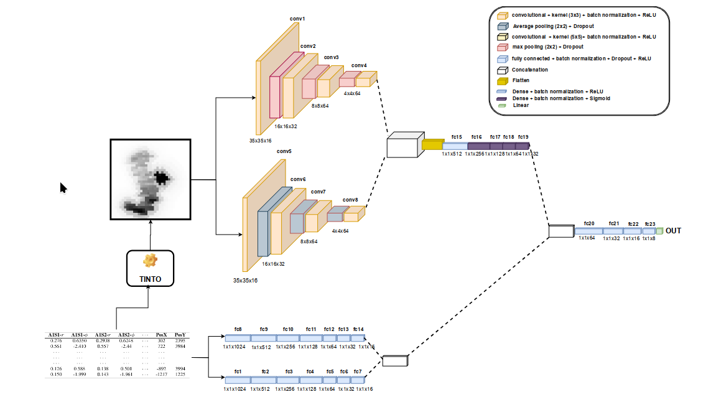

## Predicción de riesgo a contraer enfermedades coronarias


### Overview

En este proyecto se tratará de predecir el riesgo que tiene una persona a enfermedades coronarias, trabajaremos el dataset  BRFSS 2022 [1] el cual contiene aproximadamente 438,000, sin embargo hay un problema, la data está completamwnte desbalaceada, así que empecemos y veamos como se trató de resolver este problema.

El primer paso es realizar un análisis exploratorio de nuestro dataset en `EDA.ipynb`, para presente modelo me base en estudios que miden la relación con el riesgo a contraer enfermedades coronarias y se eliminaron variables con una correlación la cual puede indicar dependencia lineal entre variables, quedandoonos finalmente con las siguiente variables relevantes:


```
['CHD_OR_MI', 'SEX', 'AGE', 'HEALTH', 'PHYSICAL_ACTIVITIES',
       'BLOOD_PRESSURE', 'HIGH_CHOLESTEROL', 'CANCER', 'BRONCHITIS',
       'DEPRESSIVE_DISORDER', 'KIDNEY_DISEASE', 'DIABETES', 'ARTHRITIS', 'BMI',
       'DIFFICULTY_WALKING', 'SMOKE', 'HIV', 'ETHNICITY']W
```

Continuamente se realizó la imputación de datos nulos, para lo cual se optó por tomor la moda para todas las variables a excepción del `BMI`, por el cual se optó por la media por su naturaleza contínua. He decidido no optar por tomar acción con los valores extremos, pues lo único anómalo resultaría el `BMI`. 


Nuestra implementación final de nuestra red neuronal híbrida se encuentra en el notebook `HybridNeuralNetwork.ipynb`. Donde se usó una red neuronal híbrida con la ayuda de imágenes sintéticas con la libería de TINTO lib en base de nuestras características, se consideraron 2 redes neuronales convolucionales, las cuales luego se concatenan sus outputs en un perceptrón multicapa, por otro lado, con los datos tabulares se definieron 2 perceptron multicapa, finalmente ambos arquitecturas se concatenan en un perceptrón multicapa para con función de activación relu en las capas ocultas y sigmoide en la capa final pues nos enfrentamos a un problema de clasificación binaria. 


Las imágenes sintéticas generadas por TINTOLib, se veen de la siguiente manera:


Como se generarón 56000 imágenes no se subirán al GitHub.

Nuestra arquitectura final se ilustra de la siguiente manera:





Nuestro resultadoss obtenidos son los siguientes, donde a comparación con otros modelos, porfin obtuve un desempeño con datos reales, sin OverSampling y UnderSampling para mi modelo.


Finalmente se procedió a testear nuestro model con `test_public.csv`, obteniendo un f1-score aún superior a otros modelos.


Luego para la submisión para Kaggle, se trato con el dataset `test_private.csv` guardando los resultados en `resultados.csv`. Y pues estaremos a la espera de resultados. 


No se subieron las carpetas con las imagénes sintéticas generadas por TINTOlib, pues en total suman más de cien mil imágenes


En `OverSampling.ipynb`, traté con diferentes modelos como Decision Tree, Logistic Regression, RandomForest así como con un perceptrón multicapa, pero sin resultados, deseados.


### Requirements

Para ejecutar present proyecto, puedes importar los notebooks, a un ambiente en GoogleColab, ó puedes hacerlo en tu local, en mi caso, yo trabajé con un entorno virtual de python en mi sistema operativo Linux.


``` sh
python3 -m venv venv

pip install -r requirements.txt
```


Y a ejecutar los notebooks!
